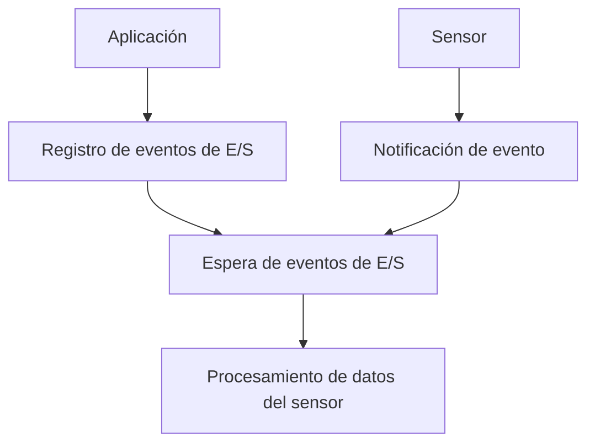

# TEMA 18: SSOO. Gestión de Entrada-Salida
# Técnicas de gestión de E/S

Los sistemas operativos modernos, como Linux y Android, utilizan diversas técnicas para gestionar las operaciones de entrada/salida (E/S) con los dispositivos de hardware. Linux es el núcleo subyacente en Android, por lo que ambos sistemas operativos comparten muchas similitudes en la gestión de E/S. A continuación se presenta un resumen general de cómo estos sistemas operativos gestionan la E/S, basándose en las bibliografías mencionadas previamente.

**Abstracción de dispositivos:** Los sistemas operativos proporcionan una capa de abstracción a través de la cual las aplicaciones interactúan con los dispositivos de hardware. En lugar de tratar directamente con el hardware, las aplicaciones realizan llamadas al sistema operativo, que a su vez maneja las operaciones de E/S con el dispositivo. Esto permite que las aplicaciones se comuniquen con diferentes dispositivos de hardware de manera uniforme y simplifica el desarrollo de software.

**Controladores de dispositivo:** Los controladores de dispositivo son programas de software que se encargan de interactuar directamente con el hardware de un dispositivo específico. Cada dispositivo de hardware tiene un controlador asociado que implementa las funciones necesarias para manejar las operaciones de E/S con ese dispositivo. Los controladores de dispositivo son esenciales en la arquitectura de E/S de Linux y Android, ya que permiten que el sistema operativo se comunique con una amplia variedad de dispositivos de hardware.

**Modelo de E/S:** Linux y Android utilizan un modelo de E/S basado en archivos. Los dispositivos de hardware se representan como archivos en el sistema de archivos, y las aplicaciones interactúan con ellos utilizando las mismas llamadas al sistema que se usan para trabajar con archivos regulares, como open(), read(), write() y close(). Esto simplifica la interacción con los dispositivos de hardware y proporciona una interfaz uniforme para la E/S.

**Buffers y cachés:** Los sistemas operativos utilizan buffers y cachés para mejorar la eficiencia de las operaciones de E/S. Los datos que se leen o escriben en un dispositivo de hardware se almacenan temporalmente en un buffer antes de ser transferidos al destino final (ya sea la memoria o el dispositivo de almacenamiento). Los cachés se utilizan para almacenar datos que se acceden con frecuencia, lo que puede reducir la cantidad de operaciones de E/S necesarias y mejorar el rendimiento del sistema.

**Asincronía y multiplexación:** Las operaciones de E/S pueden ser lentas en comparación con la velocidad de procesamiento de la CPU, por lo que los sistemas operativos modernos como Linux y Android utilizan técnicas de E/S asincrónica y multiplexación para mejorar el rendimiento. La E/S asincrónica permite que las aplicaciones continúen ejecutándose mientras se realizan operaciones de E/S en segundo plano. La multiplexación permite que varias operaciones de E/S se realicen simultáneamente, lo que puede aumentar la eficiencia del sistema.

**Acceso Directo a Memoria (DMA):** Como se mencionó anteriormente, el DMA es una técnica que permite que los dispositivos de hardware accedan directamente a la memoria del sistema sin la intervención de la CPU. Tanto Linux como Android utilizan DMA para mejorar el rendimiento de las operaciones de E/S con dispositivos de hardware compatibles.

## Gestión E/S DMA
El Acceso Directo a Memoria (DMA, por sus siglas en inglés Direct Memory Access) es una técnica utilizada en sistemas informáticos para permitir que ciertos dispositivos de hardware accedan a la memoria del sistema directamente, sin la intervención del procesador central (CPU). Esto puede mejorar el rendimiento del sistema, ya que reduce la carga de trabajo de la CPU y permite que las transferencias de datos se realicen de manera más rápida y eficiente.

En sistemas informáticos convencionales, la CPU es responsable de todas las transferencias de datos entre la memoria y los dispositivos de hardware. Sin embargo, esto puede generar una sobrecarga en la CPU, especialmente cuando se realizan transferencias de datos de alta velocidad, como en el caso de discos duros, tarjetas gráficas o dispositivos de red.

El DMA soluciona este problema al permitir que los dispositivos de hardware compatibles gestionen sus propias transferencias de datos directamente con la memoria. Esto se logra mediante un controlador DMA, que es un componente de hardware especializado que coordina las transferencias de datos entre los dispositivos de hardware y la memoria.

El funcionamiento del DMA se puede describir en los siguientes pasos:

* El dispositivo de hardware que requiere acceso a la memoria envía una solicitud al controlador DMA.

* El controlador DMA comprueba si la CPU está utilizando el bus del sistema. Si el bus está libre, el controlador DMA concede el acceso al dispositivo de hardware. Si el bus está ocupado, el controlador DMA espera hasta que esté disponible.

* Una vez que el controlador DMA tiene acceso al bus, se encarga de la transferencia de datos entre el dispositivo de hardware y la memoria. El controlador DMA utiliza el bus de direcciones para especificar las ubicaciones de memoria y el bus de datos para transferir los datos.

* Cuando se completa la transferencia de datos, el controlador DMA envía una señal de interrupción a la CPU para informarle que la operación ha finalizado. La CPU puede entonces continuar con su trabajo, procesando los datos transferidos o realizando otras tareas.

### Técnicas de acceso al bus con DMA
Existen dos tipos principales de acceso al bus por parte del DMA: acceso por ráfagas (Burst Mode) y acceso por ciclo de robo (Cycle Stealing Mode).

**Acceso por ráfagas (Burst Mode)**: En este modo, el controlador DMA toma el control del bus del sistema y lo mantiene durante toda la duración de la transferencia de datos. Es decir, realiza la transferencia de todos los datos de una vez, sin interrupciones. Este modo es más rápido, ya que permite transferencias de datos a alta velocidad, pero puede generar cierta latencia en el sistema, ya que la CPU debe esperar a que el controlador DMA libere el bus para realizar sus propias operaciones. El acceso por ráfagas es útil para transferencias de grandes bloques de datos que deben realizarse lo más rápido posible, como en el caso de copiar datos entre áreas de memoria o cargar datos desde un dispositivo de almacenamiento a la memoria.

**Acceso por ciclo de robo (Cycle Stealing Mode):** En este modo, el controlador DMA "roba" ciclos del bus del sistema de forma intermitente, permitiendo que la CPU continúe ejecutando instrucciones entre las transferencias de datos. Es decir, el controlador DMA realiza la transferencia de datos en pequeños segmentos, liberando el bus del sistema entre cada segmento para que la CPU pueda realizar sus operaciones. Este modo es más lento que el acceso por ráfagas, pero minimiza el impacto en el rendimiento de la CPU, ya que no interfiere tanto con sus operaciones. El acceso por ciclo de robo es útil para transferencias de datos en tiempo real, como en el caso de transmitir audio o video desde un dispositivo a la memoria.

La elección del modo de acceso al bus por parte del DMA dependerá de las necesidades específicas de la aplicación y del sistema. En general, el acceso por ráfagas es preferible cuando se requiere una alta velocidad de transferencia de datos, mientras que el acceso por ciclo de robo es más apropiado cuando se necesita minimizar el impacto en el rendimiento de la CPU.

## Técnicas de E/S actualidad

Las técnicas modernas de gestión de entrada/salida (E/S) en los sistemas operativos actuales se centran en mejorar el rendimiento, la eficiencia y la flexibilidad. A continuación, se enumeran algunas de las técnicas más modernas empleadas en los sistemas operativos actuales:

**E/S asincrónica y no bloqueante:** La E/S asincrónica permite que las aplicaciones inicien operaciones de E/S sin bloquear el hilo de ejecución, lo que significa que la aplicación puede continuar realizando otras tareas mientras espera que se complete la operación de E/S. La E/S no bloqueante puede mejorar significativamente el rendimiento y la eficiencia en aplicaciones con altas demandas de E/S.

**Multiplexación de E/S:** La multiplexación de E/S permite que un solo hilo de ejecución supervise y gestione múltiples operaciones de E/S simultáneas, lo que puede aumentar la eficiencia y el rendimiento al reducir la sobrecarga asociada con la creación y gestión de múltiples hilos. La multiplexación de E/S se utiliza comúnmente en servidores y aplicaciones de red con alta concurrencia.

**E/S basada en eventos:** En lugar de utilizar el modelo de sondeo tradicional, en el que una aplicación consulta periódicamente el estado de un dispositivo, la E/S basada en eventos permite que las aplicaciones sean notificadas cuando se produce un evento de E/S, como la disponibilidad de nuevos datos. Esto puede mejorar la eficiencia y reducir la latencia en aplicaciones con patrones de E/S variables.

**Almacenamiento en caché y búfer adaptativo:** Los sistemas operativos modernos emplean algoritmos inteligentes para ajustar dinámicamente el tamaño de los búferes y cachés en función de las demandas de E/S del sistema. Esto puede mejorar el rendimiento y la eficiencia al adaptarse a las condiciones cambiantes y garantizar que los recursos del sistema se utilicen de manera óptima.

**E/S virtualizada:** La virtualización de E/S permite que múltiples sistemas operativos invitados compartan dispositivos de hardware en un entorno virtualizado. Los sistemas operativos modernos pueden emplear técnicas como la asignación directa de dispositivos y la E/S paravirtualizada para mejorar el rendimiento y la eficiencia en entornos virtualizados.

**Tecnologías de almacenamiento de alta velocidad:** Los sistemas operativos actuales también están optimizados para trabajar con tecnologías de almacenamiento de alta velocidad, como unidades de estado sólido (SSD) y Non-Volatile Memory Express (NVMe). Estas tecnologías ofrecen velocidades de E/S significativamente más rápidas que las tecnologías de almacenamiento tradicionales, como los discos duros.

**Interfaces de programación de aplicaciones (API) modernas:** Los sistemas operativos modernos proporcionan API de E/S avanzadas que facilitan la implementación de técnicas de E/S de alto rendimiento en aplicaciones. Algunos ejemplos incluyen las API de E/S en Linux, como epoll y io_uring, y las API de E/S en Windows, como I/O Completion Ports y Registered I/O.

### E/S asincrónica y multiplexación de E/S

A continuación, se presenta un ejemplo del uso de E/S asincrónica y multiplexación de E/S en un servidor simple que atiende varias conexiones de cliente simultáneamente. Este ejemplo se basa en la técnica de multiplexación de E/S llamada "epoll" en Linux, pero se aplican conceptos similares para otras técnicas y sistemas operativos.

El siguiente diagrama ilustra cómo funciona la multiplexación de E/S utilizando epoll en un servidor:

ˋˋˋmermaid
graph TD
A[Aplicación Servidor] --> B[Creación epoll]
B --> C[Registro de eventos de E/S]
D[Conexiones de Cliente] --> C
C --> E[Espera de eventos de E/S]
E --> F[Procesamiento de eventos]
F --> G[Respuesta a los clientes]
ˋˋˋ
Pasos para implementar un servidor utilizando E/S asincrónica y multiplexación de E/S con epoll:

La aplicación del servidor crea una instancia de epoll utilizando la llamada al sistema epoll_create.
El servidor registra eventos de E/S de interés (por ejemplo, eventos de lectura y escritura) para cada conexión de cliente utilizando la llamada al sistema epoll_ctl. Estos eventos se asocian con los descriptores de archivo que representan las conexiones de cliente.
El servidor espera a que se produzcan eventos de E/S utilizando la llamada al sistema epoll_wait. Esta función se bloquea hasta que se produzca al menos un evento de E/S en las conexiones de cliente registradas.
Cuando se produce un evento de E/S, epoll_wait devuelve la información del evento y el servidor puede procesar el evento. Por ejemplo, si se produce un evento de lectura, el servidor puede leer los datos del cliente. Si se produce un evento de escritura, el servidor puede enviar datos al cliente.
El servidor continúa procesando eventos y respondiendo a las solicitudes de los clientes de manera eficiente sin bloquear o crear múltiples hilos de ejecución.
Este ejemplo demuestra cómo las técnicas de E/S asincrónica y multiplexación de E/S pueden mejorar la eficiencia y el rendimiento en aplicaciones de red y servidores. Utilizando técnicas como epoll, un solo hilo de ejecución puede manejar múltiples conexiones de cliente simultáneamente, lo que reduce la sobrecarga asociada con la creación y gestión de múltiples hilos.

### E/S basada en eventos y Almacenamiento en caché y búfer adaptativo
A continuación, se presenta un ejemplo que combina el tipo 3 (E/S basada en eventos) y el tipo 4 (Almacenamiento en caché y búfer adaptativo) en el contexto de una aplicación que lee datos de un sensor.

Supongamos que tenemos una aplicación que monitoriza un sensor y procesa los datos del sensor en tiempo real. En lugar de utilizar sondeo periódico para verificar si hay nuevos datos disponibles, la aplicación utiliza E/S basada en eventos para recibir notificaciones cuando el sensor tiene nuevos datos listos para leer.

El siguiente diagrama ilustra cómo funciona la E/S basada en eventos en esta aplicación:

Pasos para implementar la aplicación utilizando E/S basada en eventos:

* La aplicación registra eventos de E/S de interés (por ejemplo, eventos de lectura) para el descriptor de archivo asociado con el sensor.
* La aplicación espera a que se produzcan eventos de E/S (por ejemplo, nuevos datos disponibles en el sensor).
* Cuando el sensor tiene nuevos datos disponibles, envía una notificación de evento a la aplicación.
* La aplicación procesa los datos del sensor en respuesta al evento de E/S.
* Además de utilizar E/S basada en eventos, la aplicación también puede emplear almacenamiento en caché y búfer adaptativo para mejorar el rendimiento y la eficiencia al leer datos del sensor. Por ejemplo, si la aplicación detecta que los datos del sensor se generan a una tasa variable, puede ajustar dinámicamente el tamaño del búfer de lectura para adaptarse a las condiciones cambiantes.

En este ejemplo, la combinación de E/S basada en eventos y almacenamiento en caché y búfer adaptativo permite que la aplicación monitorice y procese eficientemente los datos del sensor en tiempo real. La E/S basada en eventos reduce la latencia al eliminar la necesidad de sondear periódicamente el sensor, mientras que el almacenamiento en caché y búfer adaptativo garantiza que los recursos del sistema se utilicen de manera óptima al leer y procesar los datos del sensor.

## epoll y io_uring

Tanto epoll como io_uring son mecanismos de E/S asincrónica en Linux que permiten a las aplicaciones manejar múltiples operaciones de E/S de forma eficiente y no bloqueante. A continuación, se presentan ejemplos de cómo funcionan epoll e io_uring en un servidor que atiende múltiples conexiones de cliente simultáneamente.

#### 1. epoll

Epoll es un mecanismo de E/S asincrónica y multiplexada que se introdujo en Linux 2.6. Es una mejora sobre los mecanismos select y poll, ya que permite manejar un gran número de descriptores de archivo de manera más eficiente.

Supongamos que tenemos un servidor TCP que maneja múltiples conexiones de cliente simultáneamente utilizando epoll. Los pasos a seguir son:

El servidor crea un socket y lo configura en modo no bloqueante.
El servidor crea una instancia de epoll utilizando la llamada al sistema epoll_create.
El servidor registra eventos de E/S de interés (por ejemplo, eventos de lectura) para el descriptor de archivo del socket utilizando epoll_ctl.
El servidor utiliza epoll_wait para esperar eventos de E/S en el socket y en las conexiones de cliente.
Cuando se produce un evento de E/S, como una nueva conexión de cliente, el servidor acepta la conexión y registra eventos de E/S para el nuevo descriptor de archivo utilizando epoll_ctl.
El servidor sigue utilizando epoll_wait para monitorear los eventos de E/S y procesar las conexiones de los clientes de forma no bloqueante.

#### 2. io_uring

Io_uring es un mecanismo de E/S asincrónica y no bloqueante más reciente y avanzado en Linux, introducido en el kernel 5.1. A diferencia de epoll, io_uring utiliza colas de envío y finalización para manejar operaciones de E/S, lo que permite un mejor rendimiento y una interfaz más fácil de usar.

Supongamos que tenemos un servidor TCP que maneja múltiples conexiones de cliente simultáneamente utilizando io_uring. Los pasos a seguir son:
* El servidor crea un socket y lo configura en modo no bloqueante.
* El servidor configura io_uring utilizando la llamada al sistema io_uring_setup, lo que crea una cola de envío y una cola de finalización.
* El servidor registra el descriptor de archivo del socket en io_uring.
* El servidor envía operaciones de E/S a la cola de envío utilizando io_uring_prep y io_uring_submit. Por ejemplo, puede enviar una operación de aceptación para aceptar nuevas conexiones de cliente.
* El servidor utiliza io_uring_wait_cqe para esperar la finalización de las operaciones de E/S en la cola de finalización.
* Cuando se completa una operación de E/S, como aceptar una nueva conexión de cliente, el servidor procesa el resultado y envía más operaciones de E/S según sea necesario, por ejemplo, leer y escribir datos en las conexiones de cliente.
*El servidor sigue utilizando io_uring_wait_cqe para monitorear la finalización de las operaciones de E/S y procesar las conexiones de los clientes de forma no bloqueante.
* En ambos ejemplos, el servidor es capaz de manejar múltiples conexiones de cliente simultáneamente de forma eficiente y no bloqueante utilizando
