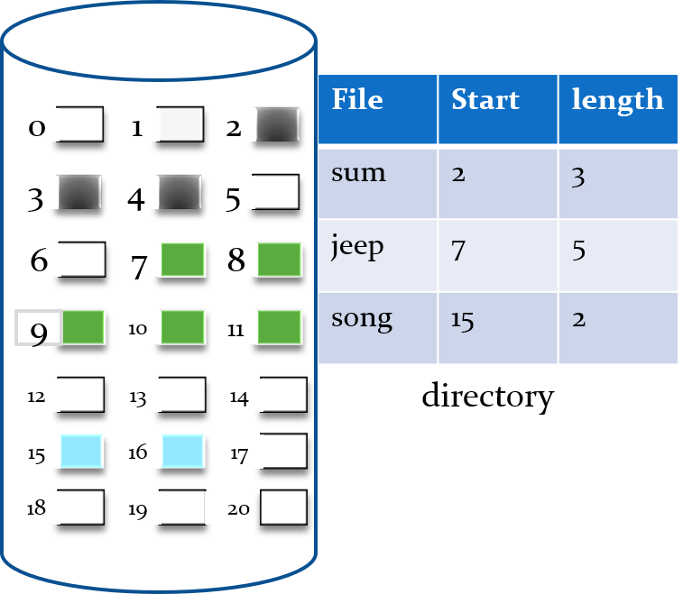
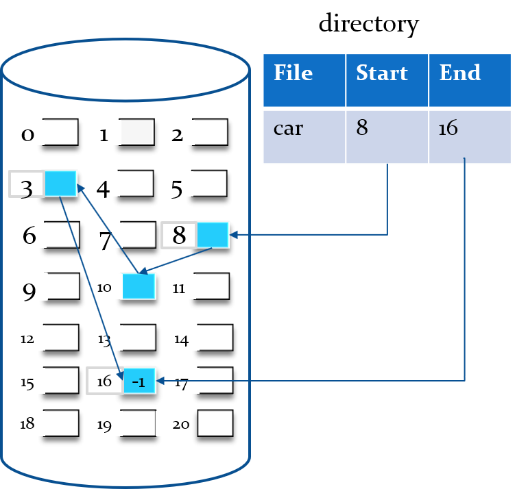
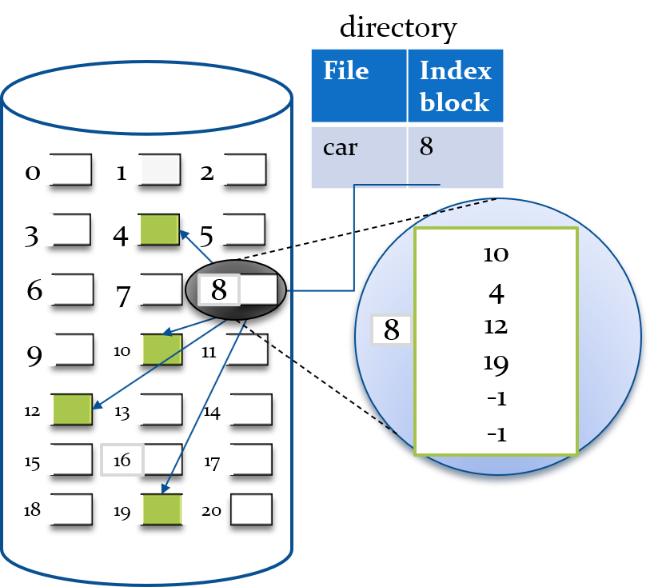

# Tema 19. Gestión de archivos y dispositivos
# 1. Introducción
# 2. Definiciones

"Operating System Concepts" de Abraham Silberschatz, Peter B. Galvin y Greg Gagne:
**Fichero (archivo):** Un archivo es una colección de información relacionada almacenada en el almacenamiento secundario de un sistema de computación, como un disco duro o una unidad de estado sólido. Los archivos pueden contener datos, programas o ambos, y son identificados por un nombre único en el sistema de archivos.

**Directorio:** Un directorio es una estructura especial de archivos que almacena información sobre otros archivos y directorios. Un directorio funciona como un contenedor que organiza y agrupa archivos y otros directorios en una estructura jerárquica.

"Modern Operating Systems" de Andrew S. Tanenbaum y Herbert Bos:
**Fichero (archivo):** Un archivo es una colección de datos almacenados en un dispositivo de almacenamiento secundario, que tiene un nombre y está estructurado de alguna manera. Los archivos pueden ser de varios tipos, como archivos de texto, archivos binarios o archivos ejecutables.

**Directorio:** Un directorio es una estructura de datos que contiene entradas de archivos y otros directorios. Los directorios permiten a los usuarios organizar y estructurar archivos de manera lógica y jerárquica.

"Operating Systems: Internals and Design Principles" de William Stallings:
**Fichero (archivo):** Un archivo es una entidad lógica en un sistema de archivos que contiene información y metadatos. Los archivos pueden ser de diferentes tipos, como archivos de texto, archivos binarios o archivos ejecutables, y se almacenan en dispositivos de almacenamiento secundario.

**Directorio**: Un directorio es una estructura lógica en un sistema de archivos que contiene información sobre archivos y otros directorios. Los directorios permiten a los usuarios organizar y estructurar archivos en una jerarquía, facilitando la búsqueda y el acceso a la información almacenada.

## 3.2. Admon. y asignación del espacio libre

Los sistemas operativos utilizan varias técnicas y algoritmos para administrar y asignar espacio libre en el almacenamiento secundario (como discos duros o unidades de estado sólido) durante la creación de nuevos archivos. Algunas de las estrategias más comunes para asignar espacio libre son las siguientes:

1. **Asignación Contigua**

   En la asignación contigua, cada archivo ocupa un conjunto de bloques contiguos en el disco. El directorio del sistema operativo simplemente necesita almacenar el número de bloque inicial y la longitud (en bloques) del archivo. Este método facilita la lectura del archivo en una sola operación y proporciona un rendimiento excelente de lectura/escritura secuencial.

   Sin embargo, la asignación contigua tiene un problema importante: la fragmentación. Con el tiempo, a medida que los archivos se crean, se eliminan y se cambia de tamaño, el espacio libre en el disco se divide en fragmentos no contiguos, lo que puede dificultar la creación de nuevos archivos grandes.

   Un ejemplo de sistema operativo que utilizó este método fue el MS-DOS.

   
   
2. **Asignación enlazada**

   En la asignación enlazada, cada archivo es una lista enlazada de bloques de disco, que no necesitan ser contiguos. Cada bloque contiene un puntero al siguiente bloque del archivo. Esto elimina el problema de la fragmentación, ya que cada nuevo archivo puede utilizar los bloques de disco libres dondequiera que estén disponibles.

   Sin embargo, la asignación enlazada dificulta la lectura y escritura aleatoria de archivos, ya que es necesario seguir los punteros de bloque a bloque. Además, si un puntero se corrompe, puede perderse todo o una parte del archivo.

   El sistema operativo FAT (File Allocation Table) utilizado en versiones antiguas de Windows usaba una variante de este método.

   
   
3. **Asignación Indexada**

   En la asignación indexada, cada archivo tiene su propio índice de bloques (también llamado tabla de índices) que contiene punteros a los bloques de disco que el archivo está utilizando. Este método combina las ventajas de la asignación contigua y enlazada. Facilita tanto el acceso secuencial como el acceso aleatorio a archivos y no sufre de fragmentación externa.

   Sin embargo, la asignación indexada puede ser ineficiente para archivos pequeños, ya que la tabla de índices puede ocupar un bloque de disco completo, incluso si el archivo en sí mismo solo utiliza una pequeña parte de un bloque.

   El sistema de archivos Unix (UFS) utiliza una variante de este método.

   
 
4. **Asignación basada en extents**
    Utilizada en sistemas de archivos como ext4 (Linux), esta técnica combina elementos de asignación contigua y asignación indexada. Un archivo se divide en extents, que son bloques contiguos de datos. Los extents se almacenan en una tabla de índices, lo que permite que el archivo ocupe bloques no contiguos en el disco. Este enfoque mejora el rendimiento y reduce la fragmentación.


## 3.3 Seguridad y protección de archivos
La protección de archivos es un aspecto fundamental de los sistemas operativos. Asegura que los archivos sean accesibles solo para los usuarios y procesos que tienen los derechos necesarios para hacerlo. Las tres formas comunes de protección de archivos son:

1. **Control de Acceso Basado en Permisos**

   Esta es probablemente la forma más común de protección de archivos. Cada archivo tiene un conjunto de permisos que determinan quién puede leer, escribir y ejecutar el archivo. Los permisos suelen dividirse en tres categorías: propietario, grupo y otros. El propietario es el usuario que creó el archivo, el grupo se refiere a un conjunto predefinido de usuarios, y otros se refiere a todos los demás usuarios del sistema.

   Un ejemplo de sistema operativo que utiliza este método es Linux. Aquí tienes un ejemplo de cómo se ven los permisos en Linux  

   ```
   -rw-r--r-- 1 root root 0 Jan 1 00:00 file.txt
   ```

   En este ejemplo, el archivo "file.txt" puede ser leído y escrito por el propietario (root), y solo leído por el grupo (root) y por los demás usuarios.

2. **Control de Acceso Basado en Listas de Acceso (ACLs)**

   Las ACLs son una forma más granular de controlar el acceso a los archivos. En lugar de simplemente dividir los permisos en propietario, grupo y otros, una ACL permite especificar permisos para usuarios y grupos individuales.

   Un sistema operativo que utiliza este método es Windows NTFS. Aquí tienes un enlace a una captura de pantalla que muestra la interfaz de ACL en Windows (texto plano): 

   ```
   https://docs.microsoft.com/en-us/windows/security/identity-protection/access-control/media/security-tab.png
   ```

3. **Control de Acceso Obligatorio (MAC)**

   En un sistema de Control de Acceso Obligatorio, el sistema operativo impone una política de seguridad que restringe el acceso a los archivos independientemente de los permisos del archivo. Los usuarios y los archivos tienen niveles de seguridad, y el acceso se permite o se niega en función de estos niveles.

   Un ejemplo de un sistema operativo que utiliza este método es SELinux, una variante de seguridad de Linux. Aquí tienes un enlace a una imagen que muestra cómo SELinux puede controlar el acceso a los archivos (texto plano):

   ```
   https://selinuxproject.org/assets/images/selinux.png
   ```

Cabe mencionar que estos son solo algunos de los métodos de protección de archivos que pueden usar los sistemas operativos. Algunos sistemas operativos pueden utilizar varios métodos en conjunto para proporcionar una protección de archivos más completa y robusta.

# Sistema gestor de archivos Linux

El sistema de archivos ext4 (cuarta versión del sistema de archivos extendido) es el sistema de archivos predeterminado para muchas distribuciones de Linux. Es una mejora de ext3, con nuevas características y mejor rendimiento. Aquí está un desglose de cómo funciona y cuál es su estructura:

**Superbloque**

El superbloque es una estructura de datos que contiene información sobre la configuración y el estado del sistema de archivos. Es esencialmente el "mapa" del sistema de archivos y es vital para su funcionamiento. En ext4, el superbloque incluye la siguiente información:

- El tamaño total del sistema de archivos
- El tamaño de cada bloque de datos en el sistema de archivos
- El número total de inodos en el sistema de archivos
- El número de inodos libres
- El número de bloques libres
- El último montaje y escritura en el sistema de archivos
- Información sobre errores del sistema de archivos
- Información sobre las opciones de montaje del sistema de archivos

En un sistema de archivos ext4, el superbloque principal se encuentra en el bloque 1 (el bloque 0 está reservado para el gestor de arranque), pero las copias de respaldo del superbloque se almacenan en varios lugares a lo largo del sistema de archivos para proteger contra la corrupción de datos.

**Grupo de Bloques**

En ext4, el sistema de archivos se divide en varios grupos de bloques para mejorar el rendimiento y la eficiencia. Cada grupo de bloques incluye lo siguiente:

- Una copia del superbloque
- Un descriptor de bloque de grupo que contiene información sobre el grupo de bloques
- Una tabla de bits de bloques que rastrea qué bloques de datos en el grupo de bloques están ocupados
- Una tabla de bits de inodos que rastrea qué inodos en el grupo de bloques están ocupados
- La tabla de inodos para el grupo de bloques
- Los bloques de datos del grupo de bloques

Dividir el sistema de archivos en grupos de bloques tiene varias ventajas. Por un lado, mejora el rendimiento al mantener los datos relacionados cerca unos de otros en el disco. Por otro lado, limita la cantidad de daño que puede hacer un error de un solo bloque: si un bloque se corrompe, solo los datos en ese grupo de bloques se verán afectados. Además, al mantener una copia del superbloque y las tablas de bits en cada grupo de bloques, el sistema de archivos puede recuperarse más fácilmente si alguna de estas estructuras de datos se corrompe.

En general, los superbloques y los grupos de bloques son elementos fundamentales de cómo ext4 organiza y gestiona los datos, y son una de las razones por las que ext4 es tan eficiente y resistente como sistema de archivos.

**Inodos**

Los inodos son estructuras de datos fundamentales en sistemas de archivos basados en Unix, como ext4. Un inodo contiene metadatos sobre un archivo o directorio y actúa como un identificador único para cada objeto en el sistema de archivos. A continuación, se presenta una descripción detallada del funcionamiento de los inodos:

1. **Metadatos del inodo**: Un inodo almacena metadatos sobre un archivo o directorio, como el tipo de objeto (archivo, directorio, enlace simbólico, etc.), el tamaño, los permisos, los propietarios (usuario y grupo), las fechas de creación, modificación y acceso, y otros atributos.

2. **Punteros de bloque**: Cada inodo contiene un conjunto de punteros de bloque que apuntan a los bloques de datos donde se almacenan los datos reales del archivo. Estos punteros se dividen en tres categorías:

   - Punteros directos: Apuntan directamente a los bloques de datos.
   - Punteros indirectos: Apuntan a un bloque de datos que contiene punteros directos.
   - Punteros doblemente indirectos: Apuntan a un bloque de datos que contiene punteros indirectos.
   - Punteros triplemente indirectos: Apuntan a un bloque de datos que contiene punteros doblemente indirectos.

   Esta estructura permite a ext4 manejar archivos de diferentes tamaños de manera eficiente.

3. **Número de inodo**: Cada inodo tiene un número de inodo único dentro del sistema de archivos. El número de inodo es un identificador que permite al sistema operativo acceder a los metadatos y los datos de un archivo sin conocer su ruta o nombre.

Aquí hay enlaces a imágenes en texto plano que muestran el funcionamiento de los inodos:

- Estructura del inodo: https://www.garykessler.net/library/images/fifs_04.png
- Punteros de bloque en un inodo: https://www.ntu.edu.sg/home/ehchua/programming/java/images/FileSystem_Inode.png

**Ejemplo**

Imagina que tienes un archivo llamado "example.txt" en un sistema de archivos ext4. Cuando se crea este archivo, se asigna un inodo para almacenar metadatos sobre él, como el tamaño del archivo, los permisos y los propietarios. El inodo también contiene punteros a los bloques de datos donde se almacenan los datos reales del archivo "example.txt".

Cuando un usuario o un programa intenta leer "example.txt", el sistema operativo busca el número de inodo asociado con este archivo (utilizando la ruta y el nombre del archivo) y luego lee los metadatos y los punteros de bloque almacenados en el inodo. Con esta información, el sistema operativo puede leer los bloques de datos que contienen el contenido real del archivo "example.txt".

**Bloques de Datos**

Los bloques de datos son donde se almacenan los datos reales de los archivos. Cada inodo apunta a los bloques de datos que contienen los datos de su archivo.