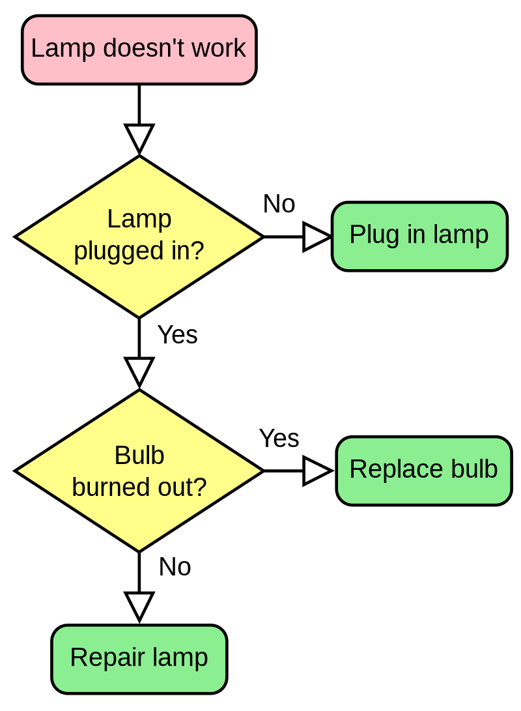
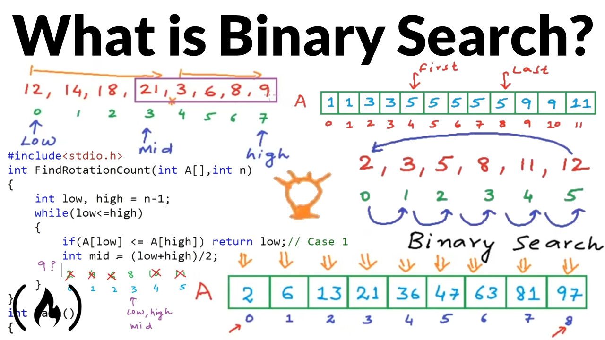

# TEMA 23: Diseño de algoritmos. Técnicas descriptivas

## 1. Introducción
El diseño de algoritmos es una disciplina fundamental en la enseñanza de la informática, ya que representa la base de la creación y optimización de programas y aplicaciones. En el ámbito de la enseñanza secundaria y la formación profesional, es esencial transmitir a los estudiantes las técnicas descriptivas que les permitirán desarrollar soluciones eficientes y comprensibles en sus futuras carreras profesionales. 

El diseño de algoritmos es una tarea esencial en la informática y, como señala Cormen et al. (2009) en su obra seminal "Introduction to Algorithms", es importante enseñar a los estudiantes cómo diseñar, analizar y optimizar algoritmos para resolver problemas complejos en un tiempo y espacio razonablemente eficientes. La técnica descriptiva es un enfoque que permite a los estudiantes comprender y comunicar algoritmos de manera clara y concisa, utilizando un lenguaje y notaciones específicas.

El diseño de algoritmos es un componente clave en la formación de estudiantes de informática en la enseñanza secundaria y profesional. La enseñanza de técnicas descriptivas como el pseudocódigo y los diagramas de flujo contribuye al desarrollo de habilidades esenciales que permitirán a los futuros profesionales abordar problemas complejos de manera eficiente y efectiva.

# 2. Algortimos y programas
Los conceptos de algoritmo y programa están estrechamente relacionados pero no son sinónimos. 

## 2.1. Algoritmo

Un algoritmo se puede definir como un conjunto ordenado y finito de pasos, que al ser ejecutados secuencialmente permiten resolver un problema específico (Cormen et al., 2009). Es decir, un algoritmo es una receta que describe cómo obtener una solución para un problema dada una entrada específica.

### Características de un algoritmo:

- **Precisión**: Los pasos de un algoritmo deben estar claramente definidos y ser inequívocos.
- **Finitud**: Un algoritmo debe tener un número finito de pasos y finalizar en un tiempo finito.
- **Entrada**: Un algoritmo acepta cero o más entradas, que son los datos iniciales sobre los que se realiza el proceso.  
- **Salida**: Un algoritmo produce una o más salidas, que son los resultados del proceso aplicado a las entradas.  
- **Efectividad**: Los pasos de un algoritmo deben ser básicos y realizables en un tiempo razonable.  

### Elementos de un algoritmo:

- **Variables**: Almacenan información y permiten representar datos en el algoritmo.
- **Estructuras de control**: Permiten la ejecución condicional de ciertos pasos o la repetición de un conjunto de pasos. Ejemplos de estas estructuras son: condicionales (if, else) y bucles (for, while).
- **Operadores**: Permiten realizar operaciones sobre los datos (aritméticas, lógicas, comparativas, etc.).
- **Funciones y procedimientos**: Permiten abstraer y reutilizar fragmentos de algoritmos, facilitando la modularidad y comprensión del mismo.

## 2.2. Programa

Un programa, por otro lado, es la implementación de un algoritmo en un lenguaje de programación específico, que puede ser ejecutado por una computadora (Knuth, 1997). Es decir, un programa es la codificación de un algoritmo en un formato que la máquina pueda interpretar y procesar. Un mismo algoritmo puede ser implementado como diferentes programas en diferentes lenguajes de programación.

## 2.3. Eficiencia de un Algoritmo
La eficiencia de un algoritmo es un aspecto crucial en el diseño y análisis de algoritmos, ya que determina cuán rápido y cuántos recursos consume un algoritmo al resolver un problema. Para medir la eficiencia de un algoritmo, se pueden utilizar dos criterios principales: el *tiempo de ejecución* (también conocido como complejidad temporal) y el *espacio de memoria utilizado* (complejidad espacial). Estos criterios se analizan a menudo en función del tamaño de la entrada (denotado como n), y se expresan mediante notaciones asintóticas, como la notación O grande .

La **complejidad temporal** de un algoritmo se refiere al tiempo que tarda en ejecutarse en función del tamaño de la entrada. Generalmente, se analiza el comportamiento asintótico del tiempo de ejecución, que describe cómo el tiempo de ejecución crece con respecto al tamaño de la entrada cuando esta aumenta. La notación O grande es la forma más común de expresar la complejidad temporal, ya que permite representar el crecimiento del tiempo de ejecución en términos de una función asintótica superior. Por ejemplo, un algoritmo con una complejidad temporal de O(n) crecerá linealmente con el tamaño de la entrada, mientras que un algoritmo con una complejidad temporal de O(n^2) crecerá cuadráticamente.

La **complejidad espacial** de un algoritmo se refiere a la cantidad de memoria que utiliza durante su ejecución en función del tamaño de la entrada. Al igual que con la complejidad temporal, la complejidad espacial se analiza utilizando notaciones asintóticas, como la notación O grande. Un algoritmo con una complejidad espacial de O(n) consumirá una cantidad de memoria proporcional al tamaño de la entrada.

Veamos un ejemplo: 
> *Evaluar la complejidad temporal y espacial del siguiente algoritmo, que encuentra el elemento más grande en una matriz de números enteros.*
```python
def encontrar_maximo(matriz):
    filas = len(matriz)
    columnas = len(matriz[0])

    maximo = matriz[0][0]

    for i in range(filas):
        for j in range(columnas):
            if matriz[i][j] > maximo:
                maximo = matriz[i][j]

    return maximo
```

Aquí se proporciona un algoritmo en Python que encuentra el valor máximo en una matriz de números enteros.

**Solución**:

*Complejidad temporal:*

El algoritmo utiliza dos bucles anidados para iterar sobre todos los elementos de la matriz. El bucle externo itera sobre las filas y tiene una complejidad de O(filas), mientras que el bucle interno itera sobre las columnas y tiene una complejidad de O(columnas). Dado que los bucles están anidados, la complejidad temporal total es O(filas * columnas). Si se asume que la matriz es de tamaño n x n (n filas y n columnas), la complejidad temporal es O(n^2).

*Complejidad espacial:*

El algoritmo utiliza una cantidad constante de memoria adicional, independientemente del tamaño de la matriz de entrada. La memoria adicional se utiliza para almacenar las variables filas, columnas y maximo. Por lo tanto, la complejidad espacial es O(1), lo que indica un uso constante de memoria adicional.

En resumen, la complejidad temporal del algoritmo es O(n^2), y la complejidad espacial es O(1).

## 2.4. Técnicas de diseño de algoritmos

Las principales técnicas de diseño de algoritmos incluyen:

**Fuerza bruta**: Consiste en probar todas las posibles soluciones del problema de manera exhaustiva hasta encontrar la solución correcta. Aunque esta técnica puede ser ineficiente en términos de tiempo de ejecución, es útil en casos en los que no existen métodos más eficientes o cuando se necesita una solución simple y fácil de entender. Ejemplo: búsqueda secuencial en una lista no ordenada (Cormen et al., 2009).

**Divide y vencerás**: Esta técnica implica dividir el problema original en subproblemas más pequeños y resolverlos de forma recursiva. Luego, las soluciones de los subproblemas se combinan para obtener la solución del problema original. Ejemplo: algoritmo de ordenación rápida (quicksort) (Cormen et al., 2009).

**Programación dinámica**: Consiste en resolver el problema dividiéndolo en subproblemas superpuestos y almacenando las soluciones intermedias en una tabla para evitar resolverlos múltiples veces. La solución final se construye a partir de las soluciones almacenadas. Ejemplo: problema de la mochila 0/1 (Cormen et al., 2009).

**Algoritmos voraces (greedy)**: Los algoritmos voraces toman decisiones óptimas locales en cada paso con la esperanza de llegar a una solución óptima global. Estos algoritmos son eficientes en términos de tiempo de ejecución, pero no siempre garantizan la solución óptima global. Ejemplo: algoritmo de Kruskal para el problema del árbol de expansión mínima (Cormen et al., 2009).

**Búsqueda y enumeración**: Esta técnica utiliza estrategias de búsqueda y exploración sistemáticas para encontrar soluciones en un espacio de búsqueda definido. Ejemplos de algoritmos de búsqueda y enumeración incluyen la búsqueda en profundidad (DFS) y la búsqueda en anchura (BFS) para recorrer grafos (Cormen et al., 2009).

**Retroceso (backtracking):** El retroceso es una técnica de búsqueda que resuelve problemas combinatorios probando posibles soluciones parciales y, si es necesario, deshaciendo las decisiones previas para probar otras opciones. Ejemplo: problema de las ocho reinas (Cormen et al., 2009).

**Heurísticas**: Las heurísticas son técnicas que guían la búsqueda de soluciones en problemas complejos o cuando no se dispone de métodos exactos. Aunque las heurísticas no garantizan soluciones óptimas, pueden proporcionar soluciones aproximadas de manera más eficiente que los métodos exhaustivos. Ejemplo: algoritmo A* para la búsqueda de caminos en grafos ponderados (Cormen et al., 2009).


# Técnicas descriptivas

**Pseudocódigo**: El pseudocódigo es una representación textual de alto nivel de un algoritmo que utiliza una sintaxis similar a la de un lenguaje de programación pero es más fácil de entender y no requiere conocimientos específicos de un lenguaje. Un ejemplo de pseudocódigo para el algoritmo de búsqueda binaria es:
```
Función búsqueda_binaria(A, valor):
    inicio = 0
    fin = longitud(A) - 1

    Mientras inicio <= fin:
        medio = (inicio + fin) / 2
        Si A[medio] == valor:
            retornar medio
        Si A[medio] < valor:
            inicio = medio + 1
        Sino:
            fin = medio - 1

    retornar -1
```
**Diagramas de flujo**: Los diagramas de flujo son representaciones gráficas de algoritmos que utilizan símbolos y conectores para mostrar el flujo de control y las operaciones realizadas. Un ejemplo de diagrama de flujo :


**Diagramas Nassi-Shneiderman (N-S)**: Los diagramas N-S son una representación gráfica estructurada que utiliza bloques anidados para representar la estructura de control y las operaciones de un algoritmo. Un ejemplo de diagrama N-S para el algoritmo de búsqueda binaria es: 


**Tablas de decisión**: Las tablas de decisión son una técnica de representación gráfica que se utiliza principalmente para modelar la lógica de decisión en algoritmos basados en reglas. Un ejemplo de tabla de decisión podría ser el cálculo del precio de un producto con descuentos en función de ciertas condiciones:


| Condición 1: Precio >= 100 | Condición 2: Cliente VIP | Acción: Aplicar descuento |
|-----------------------------|--------------------------|--------------------------|
|            Verdadero        |        Verdadero         |         20%              |
|            Verdadero        |        Falso             |         10%              |
|            Falso            |        Verdadero         |         5%               |
|            Falso            |        Falso             |         0%               |

**Diagramas de actividad UML**: Los diagramas de actividad UML son una técnica de modelado gráfico que se utiliza para representar el flujo de control y las acciones realizadas en un algoritmo o proceso. Los diagramas de actividad UML incluyen elementos como nodos de acción, nodos de decisión, nodos de bifurcación y nodos de unión. 


# Referencias bibliográficas:

> Cormen, T. H., Leiserson, C. E., Rivest, R. L., & Stein, C. (2009). Introduction to Algorithms. MIT Press.  

> Knuth, D. E. (1997). The Art of Computer Programming. Addison-Wesley.  

> Gane, C., & Sarson, T. (1979). Structured Systems Analysis: Tools and Techniques. Prentice Hall.  